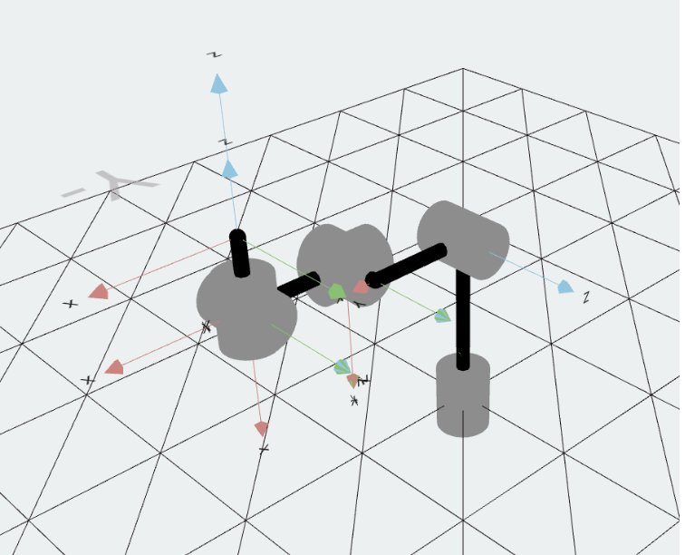

# FRA631\_HW\_Peeradon

Repository for FRA631 Class Homework

**Student ID:** 67340700403
**Name:** พีรดนย์ เรืองแก้ว

---

## Table of Contents

* [Installation](#installation)
* [Homework 1: Forward Kinematics](#homework-1-forward-kinematics)
* [Homework 2: Forward and Inverse Kinematics](#homework-2-forward-and-inverse-kinematics)
* [Homework 3: Trajectory Planning and Speed Control](#homework-3-trajectory-planning-and-speed-control)

---

## Installation

### Step 1: Create and Activate Virtual Environment

**For Windows:**

```powershell
set-executionpolicy -Scope CurrentUser -ExecutionPolicy Unrestricted
python -m venv venv
venv\Scripts\Activate.ps1
```

**For Linux or macOS:**

```bash
python3 -m venv venv
source venv/bin/activate
```

### Step 2: Install Requirements

```bash
pip install -r requirements.txt
```

---

## Homework 1: Forward Kinematics

* **PDF:** [Forward Kinematics](./Hw1/forward_kinematics_hw1.pdf)
* **Code:** [Forward Kinematics Notebook](./Hw1/forward_kinematics_hw1.ipynb)

**Robot DH Parameters:**

```python
robot = rtb.DHRobot([
    rtb.RevoluteDH(d=13, a=0, alpha=-pi/2),    # Joint 1
    rtb.RevoluteDH(d=-3, a=8, alpha=0),        # Joint 2
    rtb.RevoluteDH(d=0, a=0, alpha=pi/2),      # Joint 3
    rtb.RevoluteDH(d=8, a=0, alpha=-pi/2),     # Joint 4
    rtb.RevoluteDH(d=0, a=0, alpha=pi/2),      # Joint 5
    rtb.RevoluteDH(d=5, a=0, alpha=0)          # Joint 6
], name='6DOF_DH')
```

**Visualization:**


---

## Homework 2: Forward and Inverse Kinematics

* **PDF:** [Forward & Inverse Kinematics](./Hw2/forward&inv_kinematics_hw2.pdf)
* **Code:** [Forward & Inverse Kinematics Notebook](./Hw2/forward&inv_kinematics_hw2.ipynb)

**Results:**

```bash
q_HOME: [ 0.71448904 -1.93802991 -2.05205607 -2.27198233 -0.90031845  2.36535263]
q_IK  : [ 0.71448904 -1.93802991 -2.05205607 -2.27198233 -0.90031845  2.36535263]
Error : [ 0.0000000e+00  0.0000000e+00 -4.4408921e-16  4.4408921e-16 0.0000000e+00  0.0000000e+00]
RMSE  : 0.000000 rad
```

---

## Homework 3: Trajectory Planning and Speed Control

* **PDF:** [Trajectory Planning & Speed Control](./Hw3/tracjectory-planning&speed-control_hw3.pdf)
* **Code:** [Trajectory Planning Notebook](./Hw3/tracjectory-planning&speed-control_hw3.ipynb)

**Results:**


---
